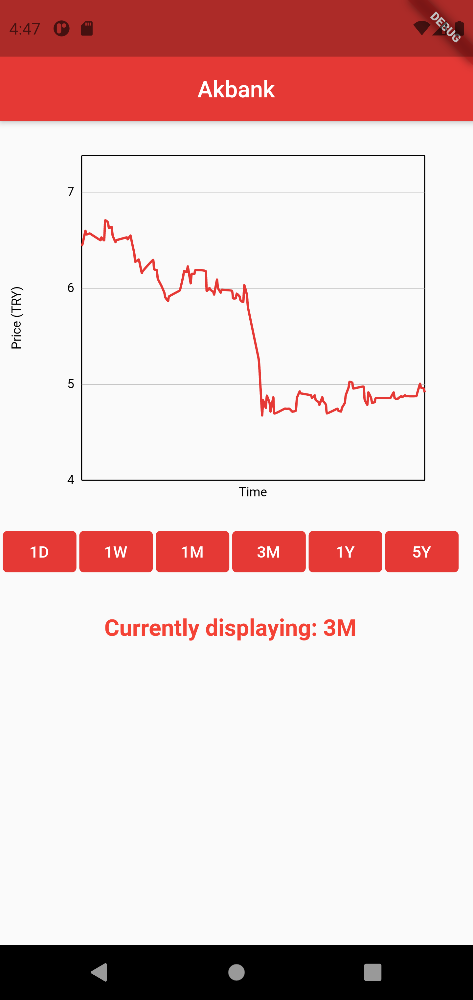
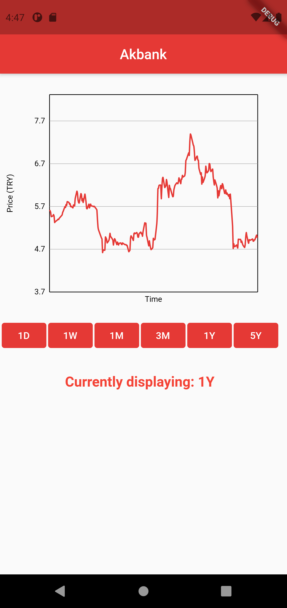

# Akbank Stock Tracker

This project tracks daily, weekly, monthly and annual changes of Akbank stock with real time data. Changes are displayed on a graph!
## Getting Started

Clone the repo
Run it on Android Studio

### Prerequisites

Flutter

### How to use

Click on the buttons presented under the graph to change the time constraints on the change of price.

## Built with

* Dart
* Flutter

## Authors

* **Efe Sozen** 
